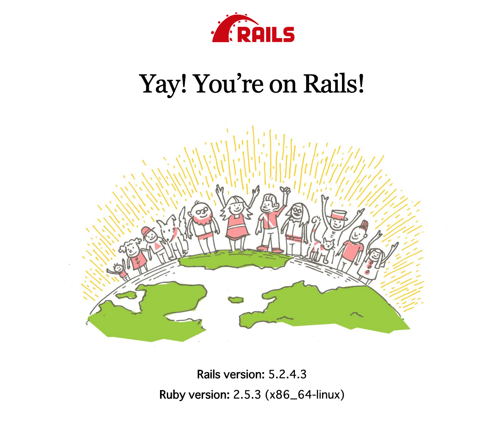

# Rails by Docker

## 概要

まずは０→１で上記表示できるまでをミニマムに。

権限回りの調整必要。


## 1 最小構成

- Dockerfile
```YAML:Dockerfile
FROM ruby:2.5.3-stretch
```

- docker-compose.yml
```YAML:docker-compose.yml
version: '3'
services:
  
  app:               # コンテナ名
    build: .         # Dockerfileのパス
    volumes:
      - '.:/app'     # ローカル:コンテナ
    ports:
      - '3000:3000' 
    tty: true        # これがないとすぐ落ちる
```

- 実行
```
<ターミナル１>
$ docker-compose up

<ターミナル２>
$ docker exec -it rails_app_1 /bin/bash
$ gem install -v 5.2.1 rails
$ cd app
$ mkdir src && cd src
$ rails new .
$ apt-get update
$ apt-get -y install nodejs
$ rails s -b 0.0.0.0
```
http://localhost:3000


## 2 コマンド作業をDockerfileに書いてく
- Dockerfile
```YAML:Dockerfile
<追記>
RUN gem install -v 5.2.1 rails
RUN apt-get update && \
    apt-get install -y nodejs
```

```
<ターミナル１>
$ docker-compose up --build

<ターミナル２>
$ docker exec -it rails_app_1 /bin/bash
$ cd app/src
$ bundle install
$ rails s -b 0.0.0.0
```
http://localhost:3000


## 3.1 Mysql追記
- docker-compose.yml
```YAML:dockr-compose.yml
...
...
  db:
    image: mysql:8.0
    # 8.0で認証プラグインが変わったので、mysql_native_passwordに戻す設定
    command: --default-authentication-plugin=mysql_native_password
    volumes:
      # コンテナ削除後もデータが残るようにMac側のディレクトリをマウント
      - "./mysql-data:/vara/lib/mysql"
    environment:
      MYSQL_ROOT_PASSWORD: root
  app:
    ....
    depends_on:
      - db
```

```
<ターミナル1>
$ docker-compose up --build

<ターミナル2>
$ docker exec -it rails_app_1 /bin/bash

$ apt-get install -y mysql-client   # mysql入ってなかった...
$ mysql -u root -proot -h db        # 接続確認
```

# 3.2 Rails側のMysql設定

```YAML
<./src/Gemfile>
gem  'mysql2'

<./src/config/database.yml>
default: &default
  adapter: mysql2
  enconding: utf8
  username: root
  password: root
  host: db
  pool: <%= ENV.fetch("RAILS_MAX_THREADS") { 5 } %>
  timeout: 5000

development:
  <<: *default
  database: rails_development
```
```
$ cd app/src
$ rake db:create
$ mysql -u root -proot -h db
mysql > show databases; => rails_developmentを確認
```

# リファクタリング後
- ディレクトリ構成
```
<ローカル>
.
├── Dockerfile
│
├── docker-compose.yml
│
├── mysql-data
│   ├── ...
│   ...
│
└── src
    ├── Gemfile
    ├── Gemfile.lock
    ├── README.md
    ├── Rakefile
    ├── app
    ├── bin
    ├── config
    ├── config.ru
    ├── db
    ├── lib
    ├── log
    ├── package.json
    ├── public
    ├── storage
    ├── test
    ├── tmp
    └── vendor


<コンテナ>
/
├── app
│   ├── Dockerfile
│   │
│   ├── docker-compose.yml
│   │
│   ├── mysql-data
│   │   ├── ...
│   │   ...
│   │
│   └── src
│       ├── Gemfile
│       ├── Gemfile.lock
│       ├── README.md
│       ├── Rakefile
│       ├── app
│       ├── bin
│       ├── config
│       ├── config.ru
│       ├── db
│       ├── lib
│       ├── log
│       ├── package.json
│       ├── public
│       ├── storage
│       ├── test
│       ├── tmp
│       └── vendor
│
├── bin
│   ├── bash
│   ...
│
var, dev, src....
...
```
- Dockerfile
```YAML:Dockerfile
FROM ruby:2.5.3-stretch

RUN gem install -v 5.2.1 rails
RUN apt-get update && \
    apt-get install -y nodejs mysql-client

COPY ./src/Gemfile /app/src/Gemfile
COPY ./src/Gemfile.lock /app/src/Gemfile.lock
RUN cd /app/src && bundle install
```

- docker-compose.yml
```YAML:docker-compose.yml
version: "3"
services:
  db:
    image: mysql:8.0
    command: --default-authentication-plugin=mysql_native_password
    volumes:
      - "./mysql-data:/var/lib/mysql"
    environment:
      MYSQL_ROOT_PASSWORD: root
  app:
    build: .
    volumes:
      - "./src:/app/src"
    ports:
      - "3000:3000"
    tty: true
    depends_on:
      - db
    working_dir: "/app"
```

# その他
コンテナに入るためのコマンドについて
```
どこからでも入れる
$ docker exec -it rails_app_1 /bin/bash

docker-compose.ymlがある場所から入れる
$ docker-compose exec app /bin/bash

rails_app_1: docker-compose upで命名されたコンテナ名
app        : docker-compose.ymlで付けたコンテナ名
```
